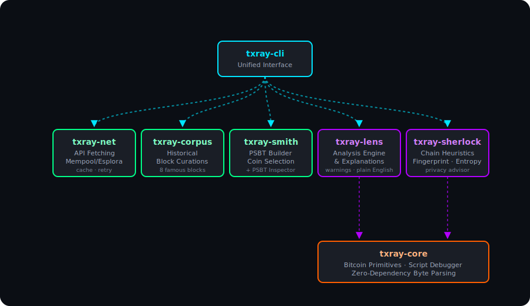

# txray

Modular Bitcoin transaction analysis and construction toolkit in Rust.

## Architecture

```
txray/
├── txray-core      Shared primitives: tx/block parsing, script classification,
│                   address derivation, weight estimation
├── txray-lens      Transaction and block analysis with warnings and
│                   plain-English explanations
├── txray-sherlock  Chain analysis heuristics: CIOH, change detection,
│                   CoinJoin, consolidation, address reuse
├── txray-smith     PSBT building, coin selection, fee estimation
├── txray-net       Fetch blocks/txs from mempool.space and Esplora
│                   with retry and disk cache
├── txray-corpus    8 historically significant blocks with educational
│                   annotations
└── txray-cli      Unified CLI: parse, analyze, build, fetch, explain
```

<p align="center">
  
</p>

> `txray-smith` is self-contained. It uses the `bitcoin` crate for PSBT construction and does not depend on `txray-core`.
> `txray-net` is also independent: raw byte fetching only, no `txray-core` dependency.

## CLI

```bash
# browse famous Bitcoin blocks
txray famous
txray famous genesis
txray famous pizza

# fetch a block from the network
txray fetch --block 170                # by height
txray fetch --block 000000000019d6...  # by hash
txray fetch --tx <txid>                # fetch raw transaction
txray fetch --block 0 --source esplora # use Esplora API

# parse transactions and blocks
txray parse tx fixture.json
txray parse block blk.dat rev.dat xor.dat

# run chain analysis heuristics
txray analyze blk.dat rev.dat xor.dat

# build a PSBT from a fixture
txray build fixture.json

# explain a transaction in plain English
txray explain fixture.json
```

## Crates

### `txray-core`
Shared Bitcoin primitives. Parses transactions and blocks from raw bytes.

- **Transaction parsing**: segwit + legacy, inputs/outputs, witness data
- **Block parsing**: headers, merkle verification, multi-block files
- **Script classification**: P2PKH, P2SH, P2WPKH, P2WSH, P2TR, OP_RETURN
- **Address derivation**: Base58Check, Bech32, Bech32m
- **Undo data**: Bitcoin Core `rev*.dat` parsing, compressed script decompression
- **Weight estimation**: WU/vbyte with segwit discount

### `txray-lens`
Transaction and block analysis engine.

- Transaction breakdown: fees, timelocks, script types
- Block-level analysis with merkle root verification
- Warning system for anomalies
- Plain-English transaction explanations

### `txray-sherlock`
Chain analysis heuristic engine (8 detectors):

| Heuristic | Description |
|-----------|-------------|
| CIOH | Common-Input-Ownership Heuristic |
| Change Detection | Identifies likely change outputs |
| Address Reuse | Flags address reuse across inputs/outputs |
| CoinJoin | Detects equal-output CoinJoin patterns |
| Consolidation | Identifies UTXO consolidation transactions |
| Self-Transfer | Detects self-transfer patterns |
| OP_RETURN | Analyzes data carrier outputs |
| Round Number | Flags round-number payment heuristic |

### `txray-smith`
PSBT construction with coin selection.

- Largest-first coin selection with fee-aware UTXO filtering
- RBF/locktime interaction matrix (5 modes)
- Weight-accurate fee estimation per script type
- Dust threshold enforcement
- Warnings for high fees, missing RBF, dust change

### `txray-net`
Fetch raw blocks and transactions from public APIs.

- **mempool.space** and **Blockstream Esplora** support
- Custom base URL
- Retry with exponential backoff (3 attempts)
- Disk cache at `~/.txray/cache/`

### `txray-corpus`
8 historically significant Bitcoin blocks with educational annotations:

Genesis Block · First Transaction · Pizza Transaction · First OP_RETURN · SegWit Activation · Largest Transaction · Wasabi CoinJoin · First Taproot Spends

Each entry explains why it's interesting and what to look for when parsing.

## Build

```bash
cargo build --workspace
cargo test --workspace     # 235 tests
cargo clippy --workspace   # zero warnings
```

## License

[MIT](LICENSE)
