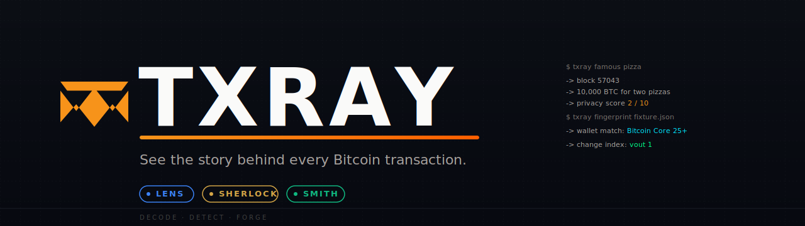
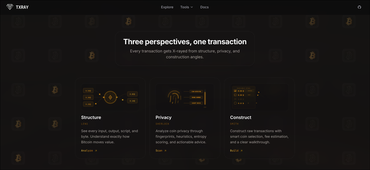
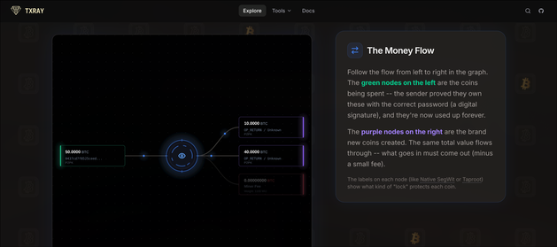
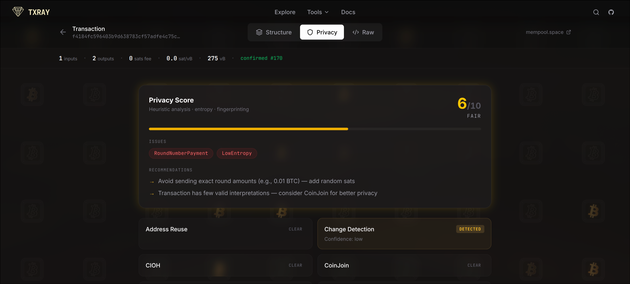
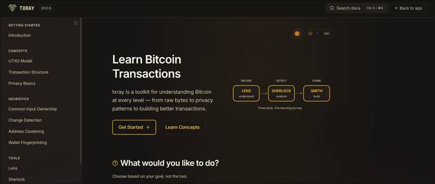
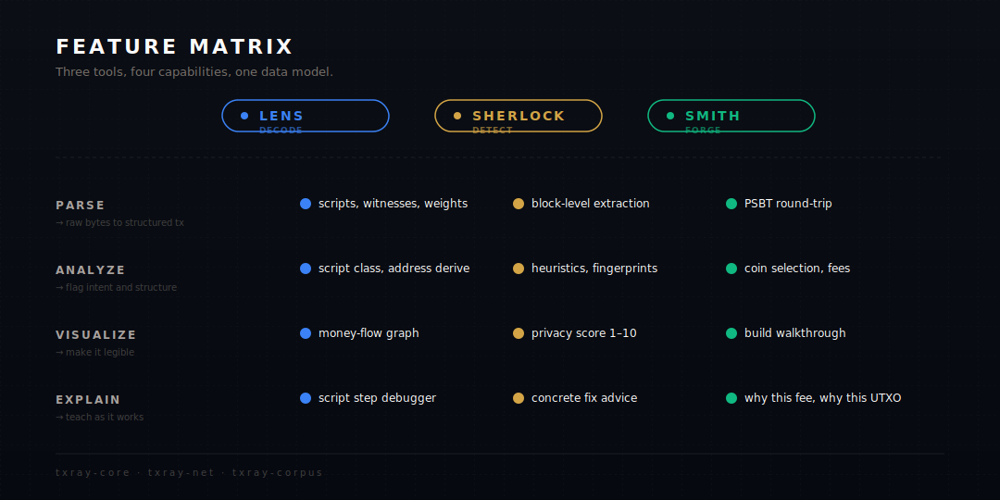

<p align="center">
  
</p>

<p align="center">
  <a href="https://github.com/keshav0479/txray/actions/workflows/ci.yml"></a>
  <a href="LICENSE"></a>
  
  
  <a href="https://github.com/keshav0479/txray/pkgs/container/txray"></a>
</p>

<br/>

> Bitcoin block explorers are great at showing raw facts. txray is built for the moment after that, when you want to understand what a transaction is doing, why it looks the way it does, and what privacy or fee tradeoffs are hiding inside it.

txray is a Rust workspace with a Next.js web app on top. The browser, CLI, and TUI all lean on the same Rust code, so the answers stay consistent whether you are learning, debugging, or preparing a demo.

<br/>

## Three Tools, One Flow

<table>
<tr>
<td width="33%" valign="top">

#### 🔵 Lens
<sub>**DECODE**</sub>

Open a transaction or block and see the structure in plain language. Lens parses inputs, outputs, scripts, fees, weights, warnings, and the money-flow graph.

</td>
<td width="33%" valign="top">

#### 🟡 Sherlock
<sub>**DETECT**</sub>

Look for privacy leaks without pretending heuristics are magic. Sherlock explains clustering signals, wallet fingerprints, entropy, and practical fixes.

</td>
<td width="33%" valign="top">

#### 🟢 Smith
<sub>**FORGE**</sub>

Build unsigned Bitcoin transactions from fixtures or addresses. Smith walks through coin selection, fee estimation, dust handling, RBF, locktime, and PSBT output.

</td>
</tr>
</table>

<p align="center">
  
</p>

<br/>

## What It Looks Like

<table align="center">
<tr>
<td width="33%"></td>
<td width="33%"></td>
<td width="33%"></td>
</tr>
</table>

<br/>

<p align="center">
  
</p>

<br/>

## Architecture

<p align="center">
  
</p>

<sub align="center">The web app is intentionally thin. It calls the same <code>txray</code> CLI used in the terminal, which keeps parsing, heuristics, and transaction-building behavior in one place.</sub>

<br/>

## Run It

<table>
<tr>
<td width="50%" valign="top">

#### Try it
<sub>The easiest way to try the full web app.</sub>

```bash
docker compose up -d --build
```

Then open [localhost:3000](http://localhost:3000).

</td>
<td width="50%" valign="top">

#### Hack on it
<sub>Best when you want to change Rust or web code.</sub>

```bash
cargo run -p txray-cli -- famous pizza
cd web && npm install && npm run dev
```

The web app runs at [localhost:3000](http://localhost:3000). The CLI stays available from your shell.

</td>
</tr>
</table>

<br/>

<details>
<summary><b>CLI reference</b></summary>

<br/>

Install the unified binary:

```bash
cargo install --path crates/txray-cli
```

#### Browse Bitcoin history

```console
$ txray famous genesis
📚 The Genesis Block
   Mined by Satoshi on 2009-01-03. Contains the famous Times headline.

$ txray famous pizza
📚 The Bitcoin Pizza Transaction
   10,000 BTC for two Papa John's pizzas (block 57043).
```

#### Fetch from public APIs

```bash
txray fetch --block 170          # first non-coinbase tx
txray fetch --tx <txid>          # any transaction by id
```

Honors `TXRAY_MEMPOOL_API` and `TXRAY_ESPLORA_API` env vars. Point it at your own Esplora instance if you self-host.

#### Parse, analyze, build, explain

```bash
txray parse tx fixture.json      # decode raw tx to structured JSON
txray analyze blk.dat            # heuristics + privacy score on a block file
txray build fixture.json         # construct PSBT with coin selection
txray explain fixture.json       # plain-English walkthrough
```

#### Privacy suite

```bash
txray fingerprint fixture.json   # which wallet probably built this?
txray entropy fixture.json       # Boltzmann mixing entropy
txray advise fixture.json        # what would have made it more private?
```

#### Low level

```bash
txray debug-script 76a914<hash>88ac --script-sig <hex>
txray inspect <base64-psbt>
```

</details>

<details>
<summary><b>TUI</b></summary>

<br/>

A keyboard-driven five-tab dashboard for when you don't want a browser.

```bash
cargo run -p txray-tui
cargo run -p txray-tui -- path/to/fixture.json
```

Tabs: Dashboard · Tx Detail · Heuristics · Famous Blocks · Script Debugger.
Navigate with `Tab`, `Shift+Tab`, or jump directly with `1` to `5`.

</details>

<details>
<summary><b>Deploying to a fresh Linux VM</b></summary>

<br/>

Once a release tag is pushed, GitHub Actions builds a multi-arch image and publishes it to [GHCR](https://github.com/keshav0479/txray/pkgs/container/txray). On the VM, you do not have to compile anything:

```bash
# one-time setup
git clone https://github.com/keshav0479/txray.git
cd txray
cp .env.example .env

# pull the latest image and run it
docker compose pull && docker compose up -d
```

To upgrade later, run `docker compose pull && docker compose up -d`. To roll back, pin an image tag with `IMAGE_TAG=v0.1.2 docker compose up -d`.

</details>

<br/>

## Configuration

Copy [.env.example](.env.example) to `.env`. These are the knobs most deployments care about:

| Variable | Default | What it does |
|---|---|---|
| `TXRAY_BIN` | `/usr/local/bin/txray` | Path to the CLI used by the web layer. Set automatically inside Docker. |
| `TXRAY_MEMPOOL_API` | `https://mempool.space/api` | Primary Bitcoin data source. Point at your own mempool/Esplora to self-host. |
| `TXRAY_ESPLORA_API` | `https://blockstream.info/api` | Fallback source. txray walks here if the primary fails. |
| `TXRAY_DATA_DIR` | OS temp directory + `/txray` | Writable runtime data directory for generated analysis results. |
| `TXRAY_TRUST_PROXY_HEADERS` | `false` | Set to `true` only behind a reverse proxy that overwrites `X-Forwarded-For`, `X-Real-IP`, or `CF-Connecting-IP`. |
| `PORT` / `HOSTNAME` | `3000` / `0.0.0.0` | Where the Next.js server binds. |

<br/>

<p align="center">
  <em>Runs entirely on your machine. No telemetry. No keys ever touched.</em>
</p>

<br/>

<div align="center">
<sub><a href="LICENSE">MIT License</a> · <a href="crates/">Crate docs</a> · Built with Rust + Next.js</sub>
</div>
