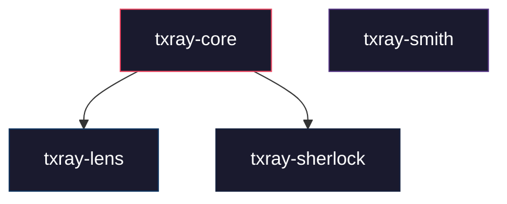

# txray

A modular Bitcoin transaction analysis and construction toolkit in Rust.

## Architecture

```
txray/
├── txray-core      — Shared primitives: tx parsing, block parsing, script
│                     classification, address derivation, weight estimation,
│                     hashing, error types
├── txray-lens      — Transaction and block analysis engine with warnings
├── txray-sherlock   — Chain analysis heuristics: CIOH, change detection,
│                     CoinJoin, consolidation, address reuse, and more
└── txray-smith     — PSBT building, coin selection, fee estimation
```



> `txray-smith` is self-contained — it uses the `bitcoin` crate for PSBT construction and does not depend on `txray-core`.

## Crates

### `txray-core`
Shared Bitcoin primitives. Zero-dependency transaction and block parsing from raw bytes.

- **Transaction parsing** — full segwit/legacy support, input/output extraction, witness handling
- **Block parsing** — header extraction, merkle verification, multi-block file support
- **Script classification** — P2PKH, P2SH, P2WPKH, P2WSH, P2TR, OP_RETURN detection
- **Address derivation** — Base58Check, Bech32, Bech32m encoding
- **Undo data** — Bitcoin Core rev*.dat parsing with compressed script decompression
- **Weight estimation** — WU/vbyte calculation with segwit discount

### `txray-lens`
Transaction and block analysis engine.

- Detailed transaction breakdown with fee analysis, timelock detection, script type distribution
- Block-level analysis with merkle root verification
- Configurable warning system for anomaly detection

### `txray-sherlock`
Chain analysis heuristic engine with 8 detectors:

| Heuristic | Description |
|-----------|-------------|
| CIOH | Common-Input-Ownership Heuristic |
| Change Detection | Identifies likely change outputs |
| Address Reuse | Flags address reuse across inputs/outputs |
| CoinJoin | Detects equal-output CoinJoin patterns |
| Consolidation | Identifies UTXO consolidation transactions |
| Self-Transfer | Detects self-transfer patterns |
| OP_RETURN | Analyzes data carrier outputs |
| Round Number | Flags round-number payment heuristic |

### `txray-smith`
PSBT construction with production-grade coin selection.

- Largest-first coin selection with fee-aware UTXO filtering
- Full RBF/locktime interaction matrix (5 modes)
- Weight-accurate fee estimation per script type
- Dust threshold enforcement
- Warning system for high fees, missing RBF, dust change

## Build

```bash
cargo build --workspace
cargo test --workspace     # 198 tests
cargo clippy --workspace   # zero warnings
```

## License

MIT
