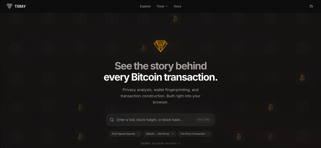

<p align="center">
  
</p>

<h1 align="center">TXRAY</h1>

<p align="center">
  <strong>See the story behind every Bitcoin transaction.</strong><br/>
  Privacy analysis, wallet fingerprinting, and transaction construction. Built right into your browser.
</p>

<p align="center">
  
</p>

---

## Three perspectives, one transaction

Every transaction gets X-rayed from structure, privacy, and construction angles.

<p align="center">
  
</p>

| | |
|---|---|
| **Lens** — Structure | See every input, output, script, and byte. Understand exactly how Bitcoin moves value. |
| **Sherlock** — Privacy | Analyze coin privacy through fingerprints, heuristics, entropy scoring, and actionable advice. |
| **Smith** — Construct | Build raw transactions with smart coin selection, fee estimation, and a clear walkthrough. |

---

## Money Flow

<p align="center">
  
</p>

Follow the flow from inputs (green) to outputs (purple). Script types, values, and warnings — all in one view.

---

## Privacy Analysis

<p align="center">
  
</p>

Privacy scored 1–10 with heuristic breakdown, wallet fingerprinting (Bitcoin Core, Electrum, Sparrow, Ledger), Boltzmann entropy, and concrete recommendations.

---

## Built-in Docs

<p align="center">
  
</p>

UTXO model, transaction structure, privacy basics, heuristics — all explained in-app. No tab switching.

---

## Run it

```bash
docker compose up -d --build
# http://localhost:3000
```

---

## CLI

```bash
# browse famous Bitcoin blocks
txray famous
txray famous genesis
txray famous pizza

# fetch a block or transaction
txray fetch --block 170
txray fetch --tx <txid>

# parse transactions and blocks
txray parse tx fixture.json
txray parse block blk.dat rev.dat xor.dat

# chain analysis heuristics
txray analyze blk.dat rev.dat xor.dat

# build a PSBT
txray build fixture.json

# plain-English explanation
txray explain fixture.json

# wallet fingerprinting
txray fingerprint fixture.json

# Boltzmann entropy
txray entropy fixture.json

# step-through script debugger
txray debug-script 76a914<hash>88ac --script-sig <hex>

# inspect a PSBT
txray inspect <base64-psbt>

# privacy advisor
txray advise fixture.json
```

<details>
<summary>Crates</summary>

### `txray-core`
Shared Bitcoin primitives — tx/block parsing, script classification, address derivation, weight estimation, script debugger.

### `txray-lens`
Transaction and block analysis with warnings and plain-English explanations.

### `txray-sherlock`
Chain analysis heuristics, wallet fingerprinting, Boltzmann entropy, privacy advisor.

| Heuristic | Description |
|-----------|-------------|
| CIOH | Common-Input-Ownership Heuristic |
| Change Detection | Identifies likely change outputs |
| Address Reuse | Flags address reuse across inputs/outputs |
| CoinJoin | Detects equal-output CoinJoin patterns |
| Consolidation | Identifies UTXO consolidation transactions |
| Self-Transfer | Detects self-transfer patterns |
| OP_RETURN | Analyzes data carrier outputs |
| Round Number | Flags round-number payment heuristic |

### `txray-smith`
PSBT construction with coin selection, fee estimation, RBF/locktime matrix, dust enforcement, PSBT inspector.

### `txray-net`
Fetch blocks/txs from mempool.space and Blockstream Esplora with retry and disk cache.

### `txray-corpus`
8 historically significant blocks with educational annotations:

Genesis Block · First Transaction · Pizza Transaction · First OP_RETURN · SegWit Activation · Largest Transaction · Wasabi CoinJoin · First Taproot Spends

</details>

---

## TUI

```bash
cargo run -p txray-tui
cargo run -p txray-tui -- path/to/fixture.json
```

5-tab dashboard — Famous Blocks, Script Debugger, Heuristics, and more. Keyboard-driven (`Tab`, `Shift+Tab`, `1-5`).

---

## License

[MIT](LICENSE)
